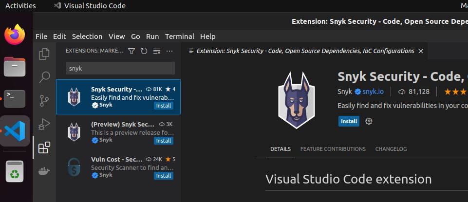
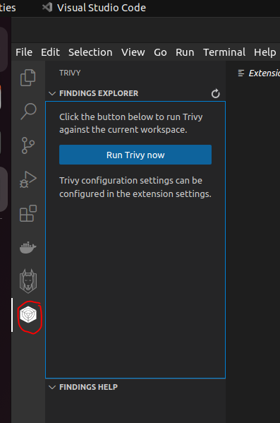

# Laboratorio 2 - Análisis de Vulnerabilidades


---

- [Laboratorio 2 - Análisis de Vulnerabilidades](#laboratorio-2---análisis-de-vulnerabilidades)
  - [Objetivo](#objetivo)
  - [Catálogo de las herramientas](#catálogo-de-las-herramientas)
  - [Métodos de Análisis](#métodos-de-análisis)
  - [Requisitos](#requisitos)
    - [Creación de cuentas en los servicios en línea de las herramientas](#creación-de-cuentas-en-los-servicios-en-línea-de-las-herramientas)
    - [Pasos previos en el equipo](#pasos-previos-en-el-equipo)
  - [Procedimiento](#procedimiento)
    - [Análisis en línea de los repositorios (GitHub)](#análisis-en-línea-de-los-repositorios-github)
      - [Snyk](#snyk)
      - [Bridgecrew (Checkov)](#bridgecrew-checkov)
      - [Sonarcloud](#sonarcloud)
      - [QWIET AI (ShiftLeft)](#qwiet-ai-shiftleft)
    - [Análisis de vulnerabilidades en el IDE](#análisis-de-vulnerabilidades-en-el-ide)
      - [Definiendo Workspace](#definiendo-workspace)
      - [Uso de la Extensión de Docker en VSCode](#uso-de-la-extensión-de-docker-en-vscode)
      - [Instalación de Extensiones en Visual Studio Code](#instalación-de-extensiones-en-visual-studio-code)
        - [Configuraciones de las extensiones](#configuraciones-de-las-extensiones)
          - [Sesiones en el explorador](#sesiones-en-el-explorador)
          - [Activación y análisis con Snyk](#activación-y-análisis-con-snyk)
          - [Activación y análisis con Trivy](#activación-y-análisis-con-trivy)
          - [Activación y análisis con Sonarlint](#activación-y-análisis-con-sonarlint)
          - [Activación y análisis con Checkov](#activación-y-análisis-con-checkov)
          - [Activación y análisis con ShiftLeft](#activación-y-análisis-con-shiftleft)
      - [Resultados Directos de Escaneos](#resultados-directos-de-escaneos)

---

## Objetivo

Por medio de las siguientes actividades usted aprenderá a realizar análisis de vulnerabilidades al código y a los contenedores con un conjunto de herramientas que ofrecen diferentes métodos y medios para la inspección.

---

## Catálogo de las herramientas

Para la ejecución de las actividades se hará uso de las siguientes herramientas Open Source o sus equivalentes en versiones gratuitas:

| Nombre | Sitio Web | Logo |
| --- | --- | --- |
| Snyk | <https://snyk.io/> | |
| Trivy | <https://trivy.dev/> |  |
| SonarQube | <https://www.sonarsource.com/open-source-editions/> |  |
| Checkov | <https://www.checkov.io/> |  |
| QWIET AI (ShiftLeft) | <https://qwiet.ai/> |  |

> __Nota__: Para cada una de las herramientas anteriores es necesario (exceptuando a Trivy) realizar la creación de una cuenta de usuario. Sin la creación de esta cuenta no podrá realizar la integración de las extensiones relacionadas en los siguientes pasos. Puede validar como crear la cuenta de los servicios en la sección de [cCreación de cuentas en los servicios en línea de las herramientas](#creación-de-cuentas-en-los-servicios-en-línea-de-las-herramientas)
---

## Métodos de Análisis

Para la ejecución de los análisis de vulnerabilidades se hará uso de los siguientes esquemas:

1. __Análisis en el repositorio:__ Se realizará una integración de la herramienta de versionamiento de código (GitHub) con las herramientas en línea para validar los proyectos que allí se encuentren.
2. __Análisis mediante IDE:__ Se realizará la instalación o integración de un plugin dentro del programa IDE. Para el caso de este laboratorio de integrará con Visual Studio Code.
3. __Análisis mediante CLI:__ Se realizará el análisis de vulnerabilidades por medio de linea de comandos con las herramientas previamente instaladas. Con la ejecución de estos comandos también se realizará el análisis sobre imágenes de contenedores ya creadas y almacenadas de manera local en el equipo

---

## Requisitos

Para la ejecución del laboratorio es indispensable realizar los siguientes pasos para poder continuar

### Creación de cuentas en los servicios en línea de las herramientas

1. Vaya la página de [GitHub](https://github.com/) y realice la creación de una cuenta con la ayuda de un correo personal, siga los pasos que le sean indicados.
2. Ya con la cuenta de GitHub creada, abra en el mismo navegador en pestañas independientes los siguientes repositorios:
   1. <https://github.com/malevarro/reactjs-shopping-cart>
   2. <https://github.com/malevarro/nodejs-goof>

3. Siga las instrucciones de la siguiente guía para realizar la copia (Fork/Bifurcación) de cada uno de los repositorios a su cuenta de GitHub

   - [Bifurcar (Fork) un repositorio](https://docs.github.com/es/get-started/quickstart/fork-a-repo?tool=webui)

4. Una vez haya creado la cuenta en GitHub ingrese a las siguientes URL en el mismo navegador en pestañas diferentes y seleccione la opción de registro con __GitHub__ y de esta forma integrar todas los servicios bajo una misma cuenta.

   | Aplicación | URL de Registro |
   | --- | --- |
   | Snyk | <https://app.snyk.io/login> |
   | Checkov (BridgeCrew) | <https://www.bridgecrew.cloud/login/signIn> |
   | Sonarcloud | <https://sonarcloud.io/login> |
   | Qwiet AI (ShiftLeft) | <https://app.shiftleft.io/login> |

### Pasos previos en el equipo

Para la ejecución de los siguientes laboratorios es necesario la descarga de un conjunto de aplicaciones sobre las cuales se van a realizar las diferentes tareas de análisis de vulnerabilidades.

1. Ingrese a la máquina virtual de Ubuntu. Las credenciales de acceso se encuentran indicadas en la descripción de la OVA entregada.
2. Ejecute la línea de comando. Es la aplicación llamada __Terminal__ en el borde izquierdo de la pantalla.
3. Acceder a la la ruta de trabajo de para los laboratorios en la carpeta '/home/hkuser/workdir'

    ```bash
    cd /home/hkuser/workdir
    ```

4. Ejecutar los siguientes comandos para realizar la descarga de las aplicaciones que serán usadas en los laboratorios.

    ```bash
    git clone https://github.com/malevarro/reactjs-shopping-cart.git
    git clone https://github.com/malevarro/nodejs-goof.git

    ```

    > Al final por cada aplicación descargada deberá existir una carpeta por cada una en la ruta de trabajo.

5. Ejecutar los siguientes comandos para realizar la descarga de algunas imágenes de contenedores que serán usadas en los laboratorios

    ```bash

    docker pull node:6-stretch
    docker pull kodekloud/simple-webapp
    docker pull kodekloud/ubuntu-ssh-enabled

    ```

    > Se puede comprobar la descarga exitosa de las imágenes de contenedores ejecutando el siguiente comando: __docker images__

---

## Procedimiento

A continuación se listan los diferentes pasos a seguir para poder realizar los análisis de vulnerabilidades sobre las aplicaciones.

### Análisis en línea de los repositorios (GitHub)

Por medio de los siguientes pasos se realizará el análisis de los repositorios copiados en su cuenta de GitHub con cada una de las herramientas que ofrecen servicios en línea tipo SaaS

#### Snyk

Para realizar el análisis de las aplicaciones con la ayuda de __Snyk__ debe realizar los siguientes pasos:

1. Ingrese a la aplicación de [Snyk](https://app.snyk.io/login) con sus credenciales respectivas en la opción de __GitHub__
2. Una vez haya ingresado siga los pasos indicados en el manual de usuarios en la sección de [Setting up a GitHub integration](https://docs.snyk.io/integrations/git-repository-scm-integrations/github-integration#setting-up-a-github-integration)
3. En el proceso debe seleccionar los repositorios que desea inspeccionar con la herramienta y luego hacer click en *Add selected repositories*

    

4. Espere a que la herramienta realice la importación y análisis de los repositorios. Al momento de terminar en la sección de *Projects* se encontrarán cada uno de los repositorios agregados con los resultados del análisis

    

5. Ingrese a los resultados obtenidos y verifique la información que se le presenta y como puede solucionar las vulnerabilidades presentes
6. Solucione algunas de las vulnerabilidades reportadas.
    > Por ejemplo puede realizar el cambio del Dockerfile de la aplicación *reactjs-shopping-cart* para que cambie la versión de la imagen de node del número 11 al 18.
    >
    > 
    >
7. Luego de realizar los cambio de código de la aplicación para solucionar las vulnerabilidades debe esperar un momento a que se actualice el estado del proyecto en __Snyk__

#### Bridgecrew (Checkov)

Para realizar el análisis de las aplicaciones con la ayuda de __Bridgecrew__ debe realizar los siguientes pasos:

1. Ingrese a la aplicación de [Bridgecrew](https://www.bridgecrew.cloud/login/signIn) con sus credenciales respectivas en la opción de __GitHub__
2. Realice la integración entre el repositorio y la herramienta con la ayuda de la siguiente guía [Integrate with GitHub](https://docs.bridgecrew.io/docs/integrate-with-githubcom) que nos brinda el fabricante.
3. Al finalizar el procesos de importación y análisis de los repositorios en la herramienta, diríjase a la sección de *Projects*, en la parte superior filtre un sólo repositorio a validar y valide la información que se esta presentando en la pantalla.

   

4. Solucione algunas de las vulnerabilidades reportadas.
5. Luego de realizar los cambio de código de la aplicación para solucionar las vulnerabilidades debe esperar un momento a que se actualice el estado del proyecto en __Bridgecrew__

#### Sonarcloud

Para realizar el análisis de las aplicaciones con la ayuda de __Sonarcloud__ debe realizar los siguientes pasos:

1. Ingrese a la aplicación de [Sonarcloud](https://sonarcloud.io/login) con sus credenciales respectivas en la opción de __GitHub__
2. Realice la integración entre el repositorio y la herramienta con la ayuda de la siguiente guía [Getting Started With GitHub](https://docs.sonarcloud.io/getting-started/github/) que nos brinda el fabricante.
3. Al finalizar el procesos de importación y análisis de los repositorios en la herramienta, diríjase a la sección de *My Projects*, en la lista haga click sobre el repositorio de la aplicación que desea investigar.

   

4. Dentro de la aplicación seleccione la opción de *Main Branch* y observe los resultados del análisis

   

5. Solucione algunas de las vulnerabilidades reportadas.
6. Luego de realizar los cambio de código de la aplicación para solucionar las vulnerabilidades debe esperar un momento a que se actualice el estado del proyecto en __Sonarcloud__

#### QWIET AI (ShiftLeft)

Para realizar el análisis de las aplicaciones con la ayuda de __QWIET AI__ debe realizar los siguientes pasos:

1. Ingrese a la aplicación de [QWIET AI](https://qwiet.ai/) con sus credenciales respectivas en la opción de __GitHub__
2. Realice la integración entre el repositorio y la herramienta con la ayuda de la siguiente guía [Using the Qwiet app for GitHub](https://docs.shiftleft.io/sast/integrations/github-marketplace#step-2-provide-access-to-your-github-repositories) que nos brinda el fabricante.
3. Al finalizar el procesos de importación y análisis de los repositorios en la herramienta, diríjase a la sección de *Applications*, en la lista haga click sobre el repositorio de la aplicación que desea investigar.

   

4. Dentro de la aplicación verifique la información presentada

    

5. Solucione algunas de las vulnerabilidades reportadas.
6. Luego de realizar los cambio de código de la aplicación para solucionar las vulnerabilidades debe esperar un momento a que se actualice el estado del proyecto en __QWIET AI__

### Análisis de vulnerabilidades en el IDE

Por medio de las siguientes acciones se realizará la inspección del código de la aplicación y de la definición del contenedor (Dockerfile) directamente en el IDE al momento de realizar el desarrollo (Coding) de los mismos. Para esta labor es necesario realizar la instalación de las extensiones de Visual Studio Code.

#### Definiendo Workspace

Con el fin de no saturar los recursos de la máquina virtual y no saturar las consultas de las extensiones a las API de los fabricantes es necesario realizar un cambio del Workspace de Visual Studio Code en donde solo incluyamos la ruta de la carpeta que solo deseamos analizar en ese momento. si dejamos el Workspace que viene por defecto tendremos problemas de operación de las diferentes extensiones.

> Para saber como realizar la creación y cambio de un workspace en Visual Studio Code se pueden consultar lo siguientes enlaces:
>
> 1. [VSCode Tutorial: How to creating a new workspace in Visual Studio Code](https://youtu.be/lQk7Hkq9YVs)
> 2. [Workspaces in Visual Studio Code](https://code.visualstudio.com/docs/editor/workspaces)

#### Uso de la Extensión de Docker en VSCode

En los siguientes pasos se realizará interacción entre la extensión de Docker instalada en VSCode

1. En la máquina virtual ejecute Visual Studio Code, haciendo click en el ícono ubicado la barra lateral izquierda.
2. Con el Visual Studio Code en ejecución, realice los siguientes pasos:
   1. Haga click en el ícono de docker que aparece en las opciones de la izquierda
   2. Verifique el panel que aparece en pantalla, allí encuentra la siguiente información:
      1. Contenedores creados
      2. Imágenes de contenedores almacenadas localmente
      3. Imágenes de contenedores en registros remotos. se puede establecer la conexión a Docker Hub con la cuenta creada en el laboratorio anterior.
      4. Redes de contenedores
      5. Volúmenes

        

   3. Haga click izquierdo y despliegue el menú de opciones. Valide la información y las acciones que obtiene por este medio.

         

#### Instalación de Extensiones en Visual Studio Code

Todas las extensiones disponibles para Visual Studio Code pueden ser consultadas en el [Marketplace](https://marketplace.visualstudio.com/vscode). Allí se pueden consultar las capacidades y requerimientos de cada una. Para realizar la instalación de cada extensión seguir los siguientes pasos:

1. En la máquina virtual ejecute Visual Studio Code, haciendo click en el ícono ubicado la barra lateral izquierda.
2. Con el Visual Studio Code en ejecución, realice los siguientes pasos para la instalación de cada una de las extensiones:
   1. Haga click en el ícono de extensiones
   2. En la barra de búsqueda ingrese el nombre de la extensión de la herramienta que desea instalar. los nombres de las extensiones son los siguientes:
      1. Snyk
      2. Trivy
      3. Sonarlint
      4. Checkov
      5. ShiftLeft CORE
   3. Luego de buscar la herramienta, haga click en el primer resultado que aparece y luego en el botón de *install*

        

   4. Espere a que finalice la instalación de la extensión y repita los pasos anteriores con cada una.
   > __Nota:__ Puede realizar la instalación de todas las extensiones de una vez o si usted prefiere puede ir instalando la extensión, realizar el análisis y luego deshabilitarla, esto con el fin de no afectar los recursos de la máquina virtual. para conocer mas sobre el manejo de las extensiones en Visual Studio Code puede consultar los siguientes enlaces:
   >
   > 1. [Extension Marketplace](https://code.visualstudio.com/docs/editor/extension-marketplace)
   > 2. [Using extensions in Visual Studio Code](https://code.visualstudio.com/docs/introvideos/extend)

##### Configuraciones de las extensiones

A continuación se indican algunas acciones a tener en cuenta para la configuración y activación de las extensiones en Visual Studio Code

###### Sesiones en el explorador

Para realizar una integración fácil y rápida de las extensiones se recomienda realizar las siguientes acciones:

1. Abra el navegador principal del equipo, para el caso de la máquina virtual es Firefox haciendo click en el ícono de la barra lateral izquierda.
2. Inicie sesión en __GitHub__ en este explorador
3. Una vez haya ingresado en la cuenta en GitHub, acceda a las siguientes URL en el mismo navegador en pestañas diferentes y seleccione la opción de autenticación con __GitHub__

   | Aplicación | URL de Registro |
   | --- | --- |
   | Snyk | <https://app.snyk.io/login> |
   | Checkov (BridgeCrew) | <https://www.bridgecrew.cloud/login/signIn> |
   | Sonarcloud | <https://sonarcloud.io/login> |
   | Qwiet AI (ShiftLeft) | <https://app.shiftleft.io/login> |

4. __NO CIERRE EL NAVEGADOR__ y vaya la aplicación de Visual Studio Code y continue con los siguientes pasos

###### Activación y análisis con Snyk

Para hacer uso de la extensión de Snyk es necesario realizar los siguientes pasos luego de realizar la instalación:

1. Haga click en el ícono de __Snyk__ que ahora se ubica en la barra lateral izquierda
2. Haga click en el botón de *Trust workspace and connect*

    

3. Espere a que abra una nueva ventana del navegador y haga click en e botón de *Authenticate*

    

4. Espere a que cargue la ventana de confirmación. En este punto ya puede volver a Visual Studio Code y ver como trabaja la extensión

    

5. Valide la información expuesta por la extensión. Solucione algunas de las vulnerabilidades reportadas.
6. Luego de realizar los cambio de código de la aplicación para solucionar las vulnerabilidades debe esperar un momento a que se actualice el estado del proyecto.

###### Activación y análisis con Trivy

Para hacer uso de la extensión de __Trivy__ es necesario realizar los siguientes pasos luego de realizar la instalación:

1. Haga click en el ícono de __Trivy__ que ahora se ubica en la barra lateral izquierda
2. Haga click en el botón de *Run Trivy now*

    

3. Espere a que finalice el análisis sobre las aplicaciones.

    

4. Valide la información expuesta por la extensión. Solucione algunas de las vulnerabilidades reportadas.
5. Luego de realizar los cambio de código de la aplicación para solucionar las vulnerabilidades debe esperar un momento a que se actualice el estado del proyecto

###### Activación y análisis con Sonarlint

Para hacer uso de la extensión de __Sonarlint__ es necesario realizar los siguientes pasos luego de realizar la instalación:

1. Haga click en el ícono de __Sonarlint__ que ahora se ubica en la barra lateral izquierda
2. Haga click en el botón de *Add SonarCloud Connection*

    

3. Se abre una nueva pestaña en la que se debe dar click en el botón de *Generate Token*

    

4. En la página web que se abre en el navegador se debe ingresar el nombre del token y dar click en el botón *Generate Token*

    

5. Aparece un código en pantalla, este código se debe copiar y llevar a la pestaña de Visual Studio Code

    

6. En la sección de *User Token* se debe incluir el código que acabamos de copiar, el campo de *Organization Key* es el nombre la organización creada en SonarCloud. Luego de llenar los datos se debe hacer click en el botón de *Save Connection* y se debe obtener como resultado un *Success1*.

    

7. Finalmente en la barra de la extensión se observa que cargan correctamente las políticas de inspección y la conexión a la nube.

    

8. El análisis de esta herramienta se realiza sobre el código de la aplicación mostrando sus resultado en las advertencias. Para mas información vaya a la session de [resultados directos](#resultados-directos-de-escaneos)

###### Activación y análisis con Checkov

Para hacer uso de la extensión de __Checkov__ es necesario realizar los siguientes pasos luego de realizar la instalación:

1. Vaya al sitio web de [__Bridgecrew__](https://www.bridgecrew.cloud/login/signIn)
2. En la consola de la herramienta vaya a la sección de *Integrations* y luego en la pantalla haga click en *API TOKENS*

    

3. En la nueva ventana se debe seleccionar la opción de *Add Token*

    

4. Ahora se debe colocar la descripción del token, y luego hacer click en el botón de *CREATE*

    

5. Aparece una nueva ventana en donde se muestra el Token, se debe copiar este valor para usar más adelante. luego hacer click en el botón de *DONE*

    

6. Instalar la extensión de __Checkov__, al finalizar la instalación hacer click en el engranaje

    

7. En la nueva pestaña del VSCode buscar la sección de *Checkov: Token* y allí colocar el valor del token que obtuvimos en los pasos anteriores y finalizar dando enter para guardar.

    

8. En la parte inferior de VSCode ya aparecerá la ejecución de la herramienta. El análisis de esta herramienta se realiza sobre el código de la aplicación mostrando sus resultado en las advertencias. Para mas información vaya a la session de [resultados directos](#resultados-directos-de-escaneos)

    

###### Activación y análisis con ShiftLeft

Para hacer uso de la extensión de __ShiftLeft__ es necesario realizar los siguientes pasos luego de realizar la instalación:

1. Haga click en el ícono de __ShiftLeft__ que ahora se ubica en la barra lateral izquierda
2. Haga Click en el botón de *Connect to ShiftLeft CORE*

    

3. En la nueva ventana del navegador haga click en la autenticación con __GitHub__

    

4. Esperar a que se realice el proceso de autenticación y luego hacer click en el botón de *Open Link* en el recuadro de notificación que se muestra

    

5. En el nuevo recuadro de notificación que se muestra hacer click en el botón de *Open*

    

6. En ese momento en VSCode el recuadro de la extensión ya queda activado

    

7. Para iniciar un escaneo con la extensión es necesario ir a *View* y seleccionar la opción de *Command Palette*. Puede abrir esto con las tecla __CTRL+Shift+p__

    

8. En el recuadro de comandos escribimos *analyze* y seleccionamos la opción relacionada con ShiftLeft

    

9. Hay que esperar a que finalice. Luego en la sección de la extensión se podrán observar los diferentes resultados del análisis

    

#### Resultados Directos de Escaneos

Como observamos en las secciones anteriores algunas extensiones (Trivy, ShiftLeft, Snyk) ofrecen su propia ventana en donde podemos observar el resultado de los diferentes escaneos, sin embargo, otras de las extensiones no ofrecen ninguna visualización directa de los resultados, para ellos es necesario hacer uso de las alerta de VSCode, las cuales se encuentran indicadas en la parte inferior izquierda.

Para ver los hallazgos de las extensiones siga los siguientes pasos:

1. haga click sobre los íconos de alertas en la parte inferior izquierda

    

2. Se despliega una nueva sección en la pantalla de VSCode en donde se observan los problemas hallados. Haga click en el ícono de justificación para cambiar el esquema de presentación a modo tabla.

    

3. Observe cada uno de los problemas y valide cual es su fuente, ya que esta corresponde a la extensión que reporta el problema

    

4. Haga Click sobre alguna de las filas de la tabla de problemas y observe como es redirigido al archivo de código fuente en donde se observa el problema

    

5. Coloque el puntero del mouse sobre la línea de código resaltada y observe el recuadro que aparece con las diferentes observaciones

    

6. Sobre el recuadro aparecen enlaces que lo pueden redirigir a sitios web donde brinden más información sobre la vulnerabilidad. haga click sobre alguno de ellos y valide la información.
7. Solucione alguna de las vulnerabilidades indicadas y valide si cambia el número de problemas reportados.
