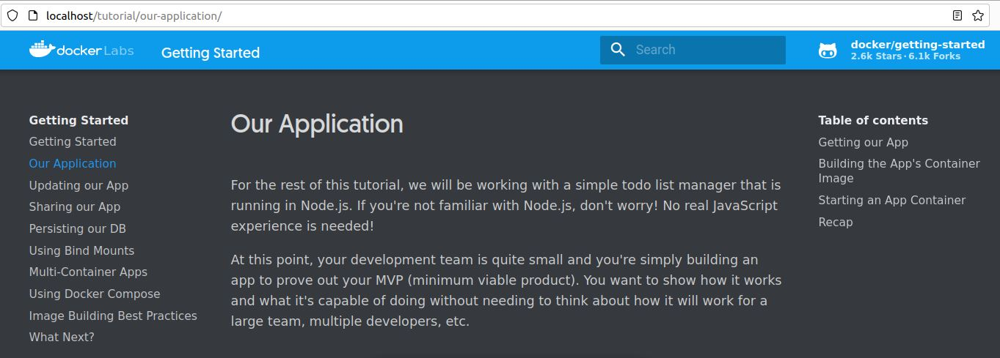

# Laboratorio 1 - Uso básico de contenedores (Docker)


- [Laboratorio 1 - Uso básico de contenedores (Docker)](#laboratorio-1---uso-básico-de-contenedores-docker)
  - [Objetivo](#objetivo)
  - [Herramientas a usar](#herramientas-a-usar)
  - [Procedimiento](#procedimiento)

## Objetivo

Por medio de la ejecución del siguiente laboratorio se busca afianzar los conocimientos sobre Docker y contenedores, así como su manejo técnico.

## Herramientas a usar

A continuación se listan las herramientas a utilizar para el laboratorio:

1. Oracle VirtualBox 7.0: se usa como hypervisor para la ejecución de la máquina virtual que posee el entorno de ejecución de Docker.
2. Oracle VM VirtualBox Extension Pack acorde con la versión del hypervisor
3. Imagen de máquina virtual Ubuntu Linux 22.04 LTS x64 Bits. Se recomiendas las siguientes características mínimas para la importación de la máquina virtual
   1. Definir mínimo 2 vCPUs
   2. 4 GB de memoria RAM
   3. 80 GB de espacio en disco para almacenamiento definido para la VM.
4. Los siguientes paquetes instalados en la máquina virtual de Ubuntu Linux:
   1. Visual Studio Code for Linux. Se puede realizar la instalación mediante el siguiente comando

        ```bash
           sudo snap install code --classic
        ```

   2. Docker Engine - Community Version 23.0.1. El proceso de instalación se encuentra detallado en la siguiente [guía](https://docs.docker.com/desktop/install/ubuntu/)
   3. Firefox Web Browser.

## Procedimiento

Realizar los siguientes pasos para el desarrollo del procedimiento

1. Ingrese a la máquina virtual de Ubuntu. Las credenciales de acceso se encuentran indicadas en la descripción de la OVA entregada.
2. Ejecute la línea de comando. Es la aplicación llamada __Terminal__ en el borde izquierdo de la pantalla.
3. Realice la descarga de la imagen que posee los siguientes pasos del laboratorio. se realiza mediante el siguiente comando

    ```bash
    docker pull docker/getting-started
    ```

4. Verificar la descarga correcta de la imagen mediante el siguiente comando

    ```bash
    docker images
    ```

5. Realice la ejecución de la imagen que contiene los laboratorios mediante el siguiente comando

    ```bash
    docker run -d -p 80:80 docker/getting-started
    ```

6. Definir la ruta de trabajo de para los laboratorios en la carpeta '/home/hkuser/workdir'

    ```bash
    cd /home/hkuser/workdir
    ```

7. Iniciar Firefox Web Browser e ingresar a __[http://localhost](http://localhost)__
8. En la página web mostrada arrancar la ejecución del laboratorio desde la sección __Our Application__

    

> Nota: recuerde descargar y manipular los archivos en la ruta especificada anteriormente.
