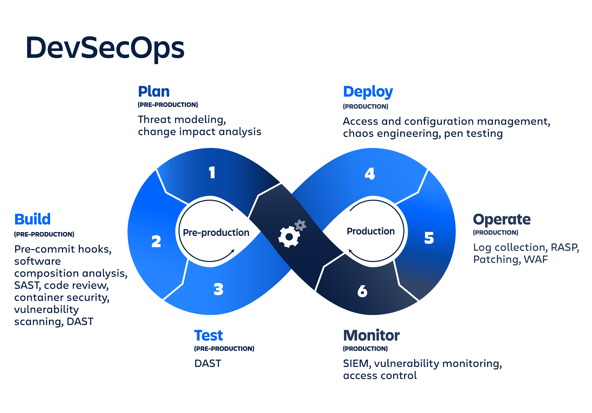
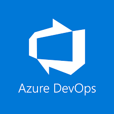
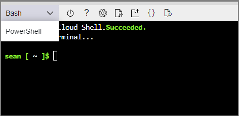
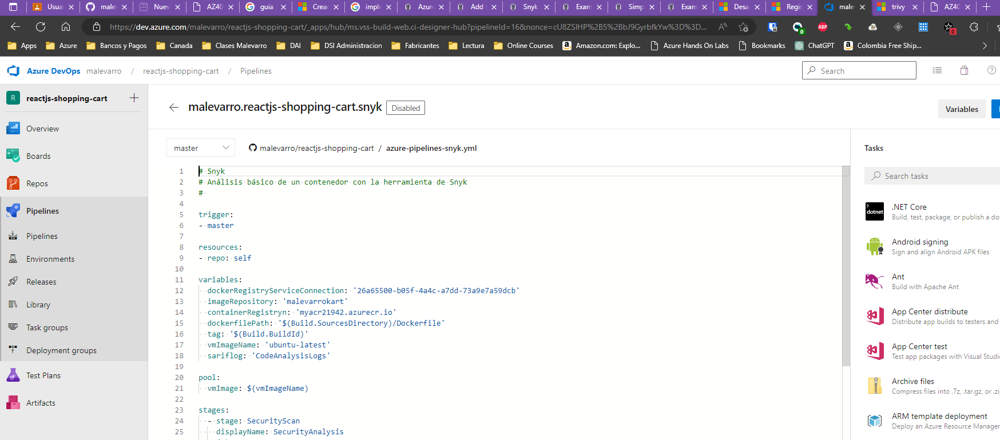

# Laboratorio 3 - Implementación de DevSecOps



---

- [Laboratorio 3 - Implementación de DevSecOps](#laboratorio-3---implementación-de-devsecops)
  - [Objetivos](#objetivos)
  - [Catálogo de herramientas](#catálogo-de-herramientas)
  - [Requisitos](#requisitos)
    - [Creación de cuentas en los servicios en línea de las herramientas](#creación-de-cuentas-en-los-servicios-en-línea-de-las-herramientas)
    - [Creación de una cuenta en Azure Cloud](#creación-de-una-cuenta-en-azure-cloud)
    - [Creación de recursos en Azure](#creación-de-recursos-en-azure)
    - [Creación de una cuenta en Azure DevOps](#creación-de-una-cuenta-en-azure-devops)
    - [Instalación de extensiones en Azure DevOps](#instalación-de-extensiones-en-azure-devops)
    - [Establecer los Service connections](#establecer-los-service-connections)
  - [Procedimiento](#procedimiento)
    - [Análisis del código en los flujos de automatización (DevSecOps)](#análisis-del-código-en-los-flujos-de-automatización-devsecops)
      - [Mend Bolt (formerly WhiteSource)](#mend-bolt-formerly-whitesource)
      - [SonarCloud](#sonarcloud)
      - [Snyk](#snyk)
  - [Referencias](#referencias)

---

## Objetivos

En este laboratorio se tienen los siguientes objetivos

1. Realizar el despliegue de un contenedor en un clúster de Kubernetes
2. Realizar la creación de una imagen de contenedores que sea cargada a un repositorio externo por medio de un flujo
3. Realizar el flujo completo de creación y despliegue de una aplicación en contenedores con ayuda de las herramientas automatizadas
4. Incluir elementos de análisis de seguridad dentro de flujo automatizado de despliegue

---

## Catálogo de herramientas

Para la ejecución de los siguientes laboratorio se hará uso de las siguientes herramientas

| Nombre | Dirección Web | Logo |
|---------|---------|---------|
| Azure | <https://portal.azure.com>|  |
| Azure DevOps | <https://dev.azure.com> |  |
| Snyk | <https://app.snyk.io/login> | |
| Sonarcloud | <https://sonarcloud.io/login> |  |
| Trivy | <https://trivy.dev/> |  |
| Mend | <https://www.mend.io/> |  |

---

## Requisitos

Para la ejecución del laboratorio es indispensable realizar los siguientes pasos para poder continuar

### Creación de cuentas en los servicios en línea de las herramientas

1. Vaya la página de [GitHub](https://github.com/) y realice la creación de una cuenta con la ayuda de un correo personal, siga los pasos que le sean indicados.
2. Ya con la cuenta de GitHub creada, abra en el mismo navegador en pestañas independientes los siguientes repositorios:
   1. <https://github.com/malevarro/reactjs-shopping-cart>
   2. <https://github.com/malevarro/nodejs-goof>

3. Siga las instrucciones de la siguiente guía para realizar la copia (Fork/Bifurcación) de cada uno de los repositorios a su cuenta de GitHub

   - [Bifurcar (Fork) un repositorio](https://docs.github.com/es/get-started/quickstart/fork-a-repo?tool=webui)

4. Una vez haya creado la cuenta en GitHub ingrese a las siguientes URL en el mismo navegador en pestañas diferentes y seleccione la opción de registro con __GitHub__ y de esta forma integrar todas los servicios bajo una misma cuenta.

   | Aplicación | URL de Registro |
   | --- | --- |
   | Snyk | <https://app.snyk.io/login> |
   | Sonarcloud | <https://sonarcloud.io/login> |

### Creación de una cuenta en Azure Cloud

1. Vaya a la página de registro de la cuenta para estudiantes gratuita de Azure con el siguiente enlace [AZURE](https://signup.azure.com/studentverification?offerType=1&correlationId=2ed1a214395c4c9eb6df31a1ce4df639)
2. Puede hacer uso de la cuenta previamente creada en __GitHub__ para hacer autoregistro, o lo puede hacer mediante la creación de una cuenta con el correo electrónico. Este correo electrónico debe ser uno correspondiente a una cuenta estudiantil, el correo debe ser válido ya que en el proceso se hará validación del mismo.
3. Siga los pasos de registro que le indican.

### Creación de recursos en Azure

Realizar la creación de los siguientes recursos en Azure para usar en el laboratorio

1. Un Azure Container Registry (ACR) para el almacenamiento de las imágenes de contenedores creadas
2. Un App Service Plan (ASP) para la ejecución de Web App Services
3. Un Web App Service para la publicación de la aplicación en Internet.

Para la creación de estos recursos realizar los siguientes pasos

1. Ingrese al portal de Azure <https://portal.azure.com> con su cuenta creada.
2. Abra la ventana de línea de comandos de la nube, como lo indica la guía [Inicio rápido para Azure Cloud Shell](https://learn.microsoft.com/es-es/azure/cloud-shell/quickstart?tabs=azurecli)
3. En el tipo de consola seleccionar el tipo __BASH__

    

4. En la consola ingresar los siguientes comandos.

    ```bash
    #---Crear variables
    export VID=$RANDOM
    export RESOURCE_GROUP=myaksrg-$VID
    export WEBAPP_NAME=myk8sapp-$VID
    export LOCATION='eastus'
    export ACR_NAME=myacr$VID

    #---Verifique variables
    echo $VID
    echo $RESOURCE_GROUP
    echo $WEBAPP_NAME
    echo $LOCATION

    #---Crear recursos
    #Grupo de Recursos
    az group create --name=$RESOURCE_GROUP --location=$LOCATION

    #---Creando ACR
    echo "Creating ACR..."
    az acr create -n $ACR_NAME -g $RESOURCE_GROUP --sku basic
    az acr update -n $ACR_NAME --admin-enabled true

    #---Obtener credenciales de acceso
    export ACR_USERNAME=$(az acr credential show -n $ACR_NAME --query "username" -o tsv)
    export ACR_PASSWORD=$(az acr credential show -n $ACR_NAME --query "passwords[0].value" -o tsv)
    
    #---Crear el ASP
    az appservice plan create -g $RESOURCE_GROUP -n $WEBAPP_NAME --is-linux --sku B1
    
    #---Crear el Web App Service
    az webapp config container set --docker-custom-image-name MyDockerCustomImage --docker-registry-server-password $ACR_PASSWORD --docker-registry-server-url https://$ACR_NAME.azurecr.io --docker-registry-server-user $ACR_USERNAME --name $WEBAPP_NAME --resource-group $RESOURCE_GROUP
    
    #---Validar Web App Service
    az webapp config container show --name $WEBAPP_NAME --resource-group $RESOURCE_GROUP
    
    #Listar los valores de las variables
    echo "Installation concluded, copy these values and store them, you'll use them later in this exercise:"
    echo "-> Resource Group Name: $RESOURCE_GROUP"
    echo "-> ACR Name: $ACR_NAME"
    echo "-> ACR Login Username: $ACR_USERNAME"
    echo "-> ACR Password: $ACR_PASSWORD"
    echo "-> Web App Name: $WEBAPP_NAME"
    
    
    #Verificar componentes creados y activos
    az group list -o table
    az acr list -o table#Listar los valores de las variables

    ```

### Creación de una cuenta en Azure DevOps

Se requiere realizar la creación de cuenta en Azure DevOps con el fin de contar con una herramienta que permita los flujos automatizados.

Para realizar la creación de la cuenta siga los pasos indicados en la guía de [Registro en Azure DevOps](https://learn.microsoft.com/es-es/azure/devops/user-guide/sign-up-invite-teammates?view=azure-devops)

### Instalación de extensiones en Azure DevOps

Por medio de la siguiente guía se realizarán los pasos necesarios para la instalación de las extensiones en Azure DevOps utilizados en los laboratorios.

[Instalar extensiones en Azure DevOps](https://learn.microsoft.com/es-es/azure/devops/marketplace/install-extension?view=azure-devops&tabs=browser)

Las extensiones requeridas en el laboratorio son las siguientes:

| Nombre | URL |
|---------|---------|
| Mend Bolt | <https://marketplace.visualstudio.com/items?itemName=whitesource.whiteSource-bolt-v2> |
| Snyk Security Scan | <https://marketplace.visualstudio.com/items?itemName=Snyk.snyk-security-scan> |
| SonarCloud | <https://marketplace.visualstudio.com/items?itemName=SonarSource.sonarcloud> |
| Trivy | <https://marketplace.visualstudio.com/items?itemName=AquaSecurityOfficial.trivy-official> |

### Establecer los Service connections

Después de realizar la creación de un nuevo proyecto en Azure DevOps se deben realizar los Service connections hacia las demás aplicaciones. 

Seguir las instrucciones indicadas en el siguiente manual de [Administrar conexiones de servicio](https://learn.microsoft.com/es-es/azure/devops/pipelines/library/service-endpoints?view=azure-devops&tabs=yaml). Se deben establecer las siguientes Service Connections

1. Azure Cloud
2. GitHub
3. Azure Container Registry (ACR)
4. Snyk Secure Scan
5. SonarCloud

---

## Procedimiento

A continuación se indican los pasos a realizar para ejecutar un análisis de las aplicaciones por medio de los flujos automatizados y/o analizando las imágenes almacenadas en los diferentes registros de contenedores que se tengan dispuestos para ello.

### Análisis del código en los flujos de automatización (DevSecOps)

#### Mend Bolt (formerly WhiteSource)

Para este laboratorio se deben realizar los pasos que se encuentran en el siguiente enlace

[Implement Security and Compliance in an Azure DevOps pipeline](https://microsoftlearning.github.io/AZ400-DesigningandImplementingMicrosoftDevOpsSolutions/Instructions/Labs/AZ400_M07_L16_Implement_Security_and_Compliance_in_an_Azure_Pipeline.html)

#### SonarCloud

Para este laboratorio se deben realizar los pasos que se encuentran en el siguiente enlace

[Managing technical debt with SonarCloud and Azure DevOps](https://microsoftlearning.github.io/AZ400-DesigningandImplementingMicrosoftDevOpsSolutions/Instructions/Labs/AZ400_M07_L17_Managing_technical_debt_with_SonarQube_and_Azure_DevOps.html)

#### Snyk

Para iniciar este laboratorio realice la creación un nuevo proyecto asociado al repositorio de __GitHub__ [reactjs-shopping-cart](https://github.com/malevarro/reactjs-shopping-cart), ejecute la tarea 1 y los tres (3) pasos indicados en la sección "Task 2: Create and Trigger a build" de la guía [Implement Security and Compliance in an Azure DevOps pipeline](https://microsoftlearning.github.io/AZ400-DesigningandImplementingMicrosoftDevOpsSolutions/Instructions/Labs/AZ400_M07_L16_Implement_Security_and_Compliance_in_an_Azure_Pipeline.html).

Se va a trabajar con el repositorio de [reactjs-shopping-cart](https://github.com/malevarro/reactjs-shopping-cart), allí hacer uso del archivo [azure-pipelines-snyk.yml](https://github.com/malevarro/reactjs-shopping-cart/blob/master/azure-pipelines-snyk.yml)



Realizar los ajustes necesarios para su entorno de trabajo en Azure DevOps

---

## Referencias

1. [AZ400-Designing and Implementing Microsoft DevOps Solutions](https://microsoftlearning.github.io/AZ400-DesigningandImplementingMicrosoftDevOpsSolutions/)
2. [Scan your Infrastructure As Code with Checkov in Azure DevOps](https://medium.com/@badawekoo/scan-your-infrastructure-as-code-with-checkov-in-azure-devops-84e6f2331ebb)
